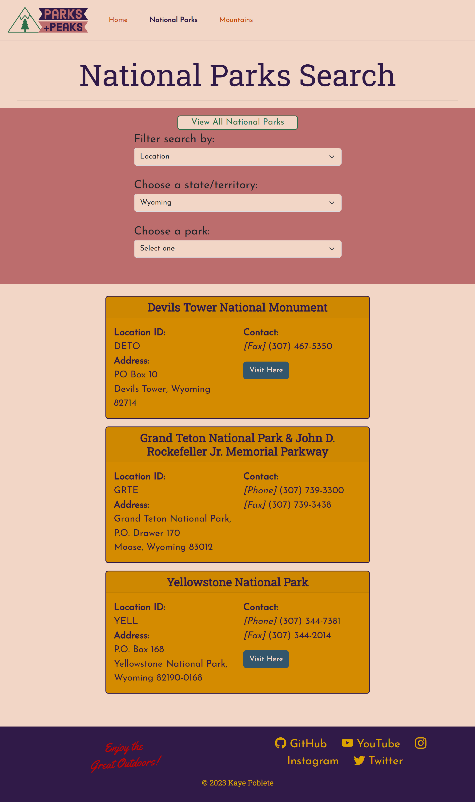

# Capstone Project 2

Built a website that specializes in finding national parks to enjoy and mountains to climb using HTML, CSS, JavaScrips, and Bootstrap.


## Features

- Main index page = Displayed a looping video with a text overlay. Displayed texts and images. Included a button that appears when user scrolls down the page, when clicked user is taken to the top of the page again. Included the navigation bar and footer.
- National Parks Search page = Included dropdown lists that helps a user filter their search of a National Park. Filter by Location, then by State or filter by Park Type then by Park Features. Both will then give a list of parks that meet the criterias. Each selection displays a list of parks and their information. Has a View All Parks button if user wants to see the entire list. Also included Scroll To Top button. Included the navigation bar and footer.
- Mountains Search Page = A dropdown list of mountains. When selected, displays the mountain's information along with an image. Fetch sunrise/sunset API and displays respective mountain data. Included the navigation bar and footer.


## Screenshots

Index Page View:


National Parks Search Page View:


Mountains Search Page View:


## Usage/Examples

```html
<!-- Scroll to the top button -->
<button type="button" class="btn btn-floating btn-lg btnScrollToTop" onclick="window.scrollTo({ top: 0, behavior: 'smooth' })"><i class="bi bi-arrow-up-circle-fill" id="iconScroll"></i></button>
```

```javascript
const btnScrollToTop = document.querySelector(".btnScrollToTop");

// Show or hide button that scrolls to the top of page
window.onscroll = () => {
    scrollFunction();
}

const scrollFunction = () => {
    if (document.body.scrollTop > 20 || document.documentElement.scrollTop > 20) {
        btnScrollToTop.style.display = "block";
    } 
    else {
        btnScrollToTop.style.display = "none";
    }
}
```

Button that appears when a user scrolls down the page and when it's clicked, it takes the user back to the top of the page again.


## Authors

Kaye Poblete
- [@kayepoblete](https://www.github.com/kayepoblete)

